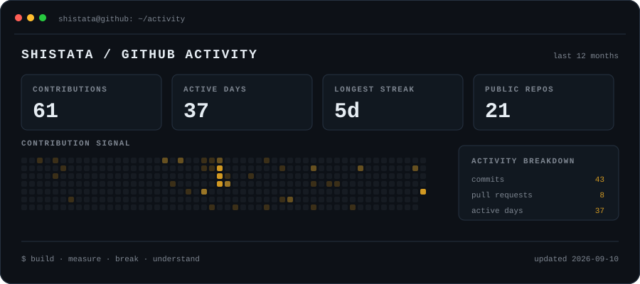

**systems researcher · software engineer**

 

[Website](https://shistuu.github.io/) ·
[LinkedIn](https://linkedin.com/in/shistatasubedi) ·
[LeetCode](https://leetcode.com/shistuu) ·
[Email](mailto:shistatasubedi24@gmail.com)

---

### Hey there 👋

I'm **Shistata**. I'm currently at the **University of Oregon**, where I spend most of my time thinking about **distributed systems, storage, networks, blockchains, and applied cryptography**.

I especially like problems where the answer isn't just an algorithm on paper. I want to know what happens when you actually build it, run it, break it, measure it, and try it at a scale where the ugly parts start showing up.

Before getting into research, I worked as a software engineer, so I still enjoy building normal software just as much as disappearing into low-level systems code.

Some days that means Rust and C++.  
Some days it's Go and Linux.  
And sometimes I am perfectly happy building something with TypeScript, React, and Node.

I don't really want to pick one side of the **researcher vs. engineer** distinction.

I like both.

---

### Things I keep coming back to

`distributed systems` &nbsp; `systems` &nbsp; `networking` &nbsp; `storage`

`cryptography` &nbsp; `blockchains` &nbsp; `performance` &nbsp; `data structures`

A recurring theme in the things I work on is:

> **How do we keep strong guarantees without making the underlying system painfully expensive?**

I like questions where answering that properly means jumping between theory, implementation, experiments, and occasionally staring at logs for much longer than I would like to admit.

---

### What I build with

  

 

I've worked across quite a few languages and frameworks over the years, but these days I care less about collecting technologies and more about being able to move between layers when a problem requires it.

Frontend, backend, distributed protocol, cryptographic primitive, network path, OS behavior — whatever is hiding the interesting bug.

---

### Research + engineering

I enjoy taking an idea through the whole lifecycle:

**question → design → build → benchmark → break → understand → improve**

That last part matters to me.

A benchmark saying something is slow is useful.

Understanding **why** it is slow is much more interesting.

---

### Outside the terminal

I spend enough time around computers that I make a point of doing things that have absolutely nothing to do with them.

I like **sports, lifting, being outdoors, traveling, and learning random things that have nothing to do with my research**.

I also maintain the extremely useful ability to fall asleep almost anywhere, at almost any time.

---

### GitHub, lately

---

### Always happy to meet interesting people working on interesting problems.

**[shistuu.github.io](https://shistuu.github.io/)**

currently somewhere between an idea, running an experiment, a bug, or most likely drinking tea

